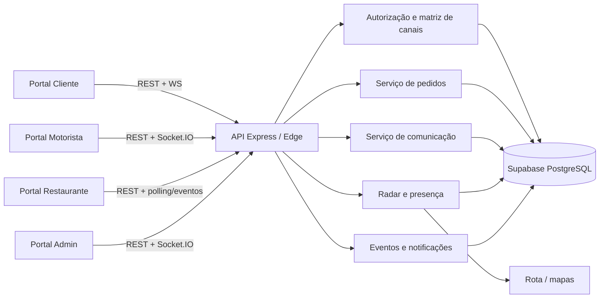

# Arquitetura técnica — rastreio e comunicação

## 1. Stack adotada

Foi preservada a stack existente do produto:

- Frontend: HTML, CSS e JavaScript puro.
- API canónica: Node.js, Express e Socket.IO.
- API compatível serverless: Supabase Edge Function em TypeScript.
- Dados: Supabase PostgreSQL via PostgREST/RPC.
- Mapas: Leaflet, geocodificação/roteamento existentes.
- Autenticação: JWT por papel e token público específico por pedido, guardado como hash.

## 2. Componentes



## 3. Modelo de dados

### `orders`

```json
{
  "id": "24-char-id",
  "client": "client-id",
  "client_name": "Nome",
  "client_phone1": "84...",
  "client_notes": "Tocar à campainha",
  "restaurant_id": "restaurant-id",
  "assigned_to_driver": "driver-profile-id",
  "status": "atribuido",
  "restaurant_status": "preparing",
  "partner_confirmed_at": "2026-07-24T10:00:00Z",
  "pickup_authorized_at": null,
  "pickup_address_text": "Loja",
  "pickup_address_coords": { "lat": -25.9, "lng": 32.5 },
  "address_text": "Destino",
  "address_coords": { "lat": -25.8, "lng": 32.6 },
  "route_distance_km": 4.2,
  "route_duration_min": 16,
  "payment_method": "mpesa",
  "payment_status": "pending"
}
```

### `conversations` e `order_messages`

```json
{
  "conversation": {
    "order_id": "order-id",
    "channel_type": "driver_partner",
    "scope": "order"
  },
  "message": {
    "order_id": "order-id",
    "conversation_id": "conversation-id",
    "sender_role": "restaurant",
    "sender_id": "restaurant-id",
    "body": "Entrada lateral para recolha.",
    "message_type": "text",
    "channel_type": "driver_partner",
    "visible_to_roles": ["driver", "restaurant", "admin"],
    "created_at": "2026-07-24T10:02:00Z"
  }
}
```

### `driver_presence`

```json
{
  "driver_profile_id": "driver-id",
  "is_online": true,
  "is_available": true,
  "current_order_id": null,
  "latitude": -25.9692,
  "longitude": 32.5732,
  "accuracy": 8,
  "speed": 4.5,
  "heading": 140,
  "last_seen_at": "2026-07-24T10:03:00Z",
  "location_updated_at": "2026-07-24T10:02:58Z",
  "version": 12
}
```

### `driver_offers`

```json
{
  "id": "offer-id",
  "order_id": "order-id",
  "driver_profile_id": "driver-id",
  "status": "pending",
  "selected_by_role": "client",
  "expires_at": "2026-07-24T10:05:00Z",
  "responded_at": null
}
```

### `order_status_events`, `audit_logs`, `notifications`

`order_status_events` é a cronologia de negócio; `audit_logs` guarda quem fez o quê; `notifications` entrega avisos por destinatário. Mensagens e auditoria são conceitos distintos: a auditoria não deve copiar segredos nem o texto completo sem necessidade.

### `payments`

O MVP mantém pagamento no próprio pedido porque a base atual opera assim. Quando houver autorização, captura, estorno ou múltiplas tentativas, extrair para:

```json
{
  "id": "payment-id",
  "order_id": "order-id",
  "method": "mpesa",
  "status": "authorized",
  "amount": 450,
  "currency": "MZN",
  "provider_reference": "masked-reference",
  "created_at": "..."
}
```

## 4. Matriz de autorização

| Recurso | Cliente | Motorista | Loja | Admin |
|---|---:|---:|---:|---:|
| Pedido próprio/atribuído | leitura segura | leitura atribuída | leitura associada | todos |
| `client_driver` | ler/escrever | ler/escrever | negar | ler/escrever |
| `driver_partner` | negar | ler/escrever | ler/escrever | ler/escrever |
| `system` | ler | ler | ler | ler |
| Atribuir motorista | negar | aceitar oferta | negar | permitido |
| Confirmar/autorizar recolha | negar | consultar | permitido | auditar |
| Atualizar entrega | negar | permitido | negar | cancelar/atribuir |
| Auditoria | negar | negar | negar | leitura restrita |

Além da validação na API, RLS bloqueia acesso direto anónimo às tabelas operacionais. A service role é usada exclusivamente no servidor.

## 5. APIs

Contrato detalhado: `docs/openapi/tracking-communication.openapi.yaml`.

Principais grupos:

- Cliente: criar pedido, contexto, radar/oferta, mensagens e cancelamento.
- Motorista: entregas, resposta à oferta, mensagens por canal e fases.
- Loja: pedidos, confirmação, preparação, autorização, cancelamento e mensagens.
- Admin: criação, atribuição, cancelamento, auditoria e canais.

Erros seguem `{ "message": "..." }`; conflitos de transição/concorrência usam HTTP 409.

## 6. Tempo real

- Cliente: contexto e mensagens com polling de 7 segundos como fallback.
- Motorista/Admin: Socket.IO para localização, presença, atribuição e mudanças.
- Persistência: cada localização válida atualiza `driver_presence`.
- Frescura: heartbeat deve ter no máximo 60 s; uma coordenada estacionária pode ser reutilizada por até 10 min.
- Raio: procura primeiro em 5 km e expande automaticamente até 25 km quando necessário.
- Desconexão: 45 segundos de tolerância evitam retirar motoristas por oscilações curtas.
- Reconexão: o pedido ativo restaura `busy`, `pickup` ou `delivery`; não marca indevidamente como livre.

Eventos recomendados:

| Evento | Destino | Payload mínimo |
|---|---|---|
| `order_status_changed` | Cliente/Admin | `orderId`, estado público, data |
| `order_message_created` | sala do canal/Admin | `orderId`, `messageId`, `channel` |
| `driver_location_updated` | Cliente/Admin | `driverId`, coordenadas, data |
| `driver_offer_created` | Motorista | `offerId`, `orderId`, expiração |
| `driver_status_changed` | Admin/radar | `driverId`, disponibilidade |
| `pickup_authorized` | Motorista/Admin | `orderId`, data |

## 7. Correção do radar

Problema anterior: a descoberta dependia de estado e localização guardados no perfil, que podiam permanecer “online” depois de uma desconexão ou ficar desatualizados. Isso criava falsos positivos e, em outros casos, excluía motoristas válidos.

Correção:

1. `driver_presence` é a fonte operacional.
2. Heartbeat e localização têm datas separadas.
3. Consulta exige ambos recentes.
4. A oferta reserva o Motorista atomicamente.
5. Expiração/recusa/cancelamento/entrega libertam a reserva.
6. Índices atendem a consulta de disponibilidade.
7. O próximo passo para escala é PostGIS com índice GiST e busca por raio no banco.

## 8. Sequência de publicação

1. Criar snapshot/backup da base.
2. Aplicar `backend/supabase/migrations/2026-07-24-tracking-communication-security.sql`.
3. Verificar tabelas, índices, RPCs e RLS.
4. Publicar a Edge Function e/ou API Express.
5. Publicar os ficheiros dos portais.
6. Executar smoke tests de quatro papéis.
7. Monitorizar 5xx, latência, ofertas e presença.

Rollback da aplicação é compatível: a migração só adiciona estruturas e preserva campos antigos. Não remover colunas no mesmo release.

## 9. Observabilidade

- correlation/request ID em API, auditoria e eventos;
- métricas por endpoint, papel, status e canal;
- alerta se p95 de contexto exceder 500 ms por 10 minutos;
- alerta se pedidos pendentes sem candidato exceder a linha de base;
- job de reconciliação de presença versus pedidos ativos;
- dashboards sem números de telefone, conteúdo de chat ou tokens.
