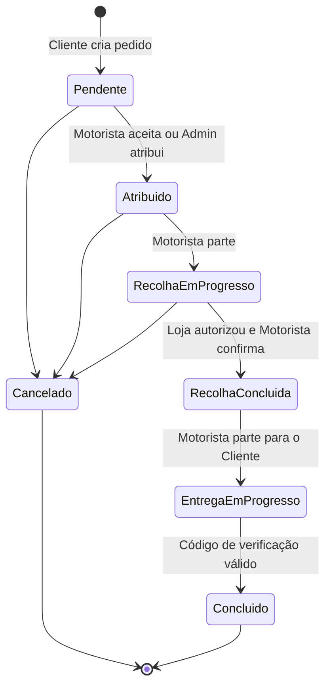

# PRD — Rastreio e comunicação de pedidos

Versão: 1.0  
Data: 24 de julho de 2026  
Estado: núcleo do MVP implementado no repositório

## 1. Objetivo

Entregar um fluxo de pedido rastreável, auditável e seguro entre Cliente, Motorista e Estabelecimento. O Motorista é a ponte operacional: recebe as notas do Cliente, coordena a recolha com a Loja/Restaurante/Parceiro e conduz a entrega. O Cliente nunca recebe nem envia mensagens no canal interno Motorista ↔ Loja.

## 2. Atores e responsabilidades

| Ator | Responsabilidades | Pode comunicar com |
|---|---|---|
| Cliente | Criar pedido, indicar notas e destinos, escolher/aguardar motorista, acompanhar os estados públicos, falar com o motorista, cancelar enquanto permitido | Motorista e Suporte |
| Motorista | Aceitar ou recusar oferta, seguir instruções e rota, coordenar a recolha, atualizar fases e concluir a entrega | Cliente, Loja e Suporte, em canais separados |
| Restaurante/Loja/Parceiro | Confirmar a receção, marcar “Em preparação”, autorizar recolha, cancelar com justificativa e coordenar exceções | Motorista e Suporte |
| Admin | Criar/consultar pedidos, atribuir motorista manualmente, cancelar, auditar estados e canais, intervir no canal selecionado | Todos, sem misturar os canais |
| Sistema | Validar transições, sincronizar presença, expirar ofertas, publicar estados permitidos, registar auditoria e emitir eventos | Todos conforme a visibilidade do evento |

## 3. Princípios obrigatórios

1. Um pedido tem três conversas operacionais: `client_driver`, `driver_partner` e `system`.
2. Mensagens de `driver_partner` nunca são devolvidas ao Cliente, nem mesmo no histórico.
3. O Motorista escolhe explicitamente o canal antes de enviar.
4. O Estabelecimento escreve apenas em `driver_partner`.
5. O Cliente escreve apenas em `client_driver`.
6. O Admin pode auditar ambos, mas deve escolher o canal de destino antes de responder.
7. Estados internos de deslocação para recolha não são apresentados como novos estados ao Cliente.
8. Todas as mudanças críticas produzem `audit_logs` e `order_status_events`.

## 4. Fluxo funcional

### 4.1 Pedido do Cliente

1. Cliente informa dados, recolha, destino, pagamento e `client_notes`.
2. API valida os campos, calcula rota/preço e grava o pedido em `pendente`.
3. Sistema cria os três canais e um token público guardado apenas como hash.
4. Cliente pode abrir o radar ou aguardar atribuição manual.

### 4.2 Oferta e aceitação

1. Radar consulta apenas `driver_presence` com:
   - `is_online = true`;
   - `is_available = true`;
   - nenhuma encomenda ativa;
   - heartbeat com no máximo 60 segundos;
   - última coordenada com no máximo 10 minutos quando o Motorista permanece online;
   - procura inicial em 5 km e expansão automática até 25 km quando não há candidato próximo.
2. Uma RPC transacional cria a oferta, bloqueia concorrência e reserva temporariamente o Motorista.
3. O Motorista aceita ou recusa.
4. Aceitação atómica atribui o pedido, encerra a oferta e marca presença como ocupada.
5. O Cliente recebe “Pedido confirmado”.

### 4.3 Rota e recolha

1. Motorista inicia recolha e segue a rota até à Loja/Parceiro.
2. Notas do Cliente e instruções de recolha ficam disponíveis ao Motorista.
3. A Loja confirma que recebeu o pedido.
4. A Loja marca “Em preparação”; este estado é público.
5. A Loja autoriza a recolha.
6. O Motorista não pode concluir a recolha de um pedido ligado a estabelecimento antes dessa autorização.

### 4.4 Entrega

1. Motorista inicia a entrega; o Cliente recebe “A caminho”.
2. Localização é sincronizada em tempo real.
3. Motorista conclui com o código de verificação e, quando aplicável, confirmação do pagamento.
4. Cliente recebe “Entregue”.

### 4.5 Cancelamento

1. Loja só pode cancelar antes da recolha e deve fornecer uma justificativa.
2. Cliente/Admin podem cancelar nas fases permitidas.
3. O estado público é “Cancelado” com a justificativa.
4. Oferta é cancelada, presença é libertada e a ação fica auditada.

## 5. Estados



Mapeamento público:

| Estado/facto interno | Cliente vê |
|---|---|
| `pendente` | A aguardar confirmação |
| `atribuido`, `recolha_em_progresso` | Pedido confirmado |
| `restaurant_status = preparing`, `recolha_concluida` | Em preparação |
| `entrega_em_progresso` | A caminho |
| `concluido` | Entregue |
| `cancelado` | Cancelado + justificativa |

## 6. Requisitos funcionais do MVP

- [x] Criar pedido com notas do Cliente.
- [x] Consultar motoristas online, disponíveis e recentes.
- [x] Ofertar pedido e aceitar/recusar de forma atómica.
- [x] Atribuir motorista manualmente pelo Admin.
- [x] Confirmar receção e autorizar recolha pela Loja.
- [x] Atualizar fases pelo Motorista.
- [x] Publicar estados permitidos ao Cliente.
- [x] Separar canais Cliente ↔ Motorista e Motorista ↔ Loja.
- [x] Registar histórico de estados e auditoria.
- [x] Atualizar localização por Socket.IO e presença persistida.
- [x] Aplicar tolerância de 45 segundos a desconexões transitórias.
- [x] Exibir cancelamento com justificativa.
- [ ] Notificações push/SMS fora do navegador.
- [ ] Painel de observabilidade com SLOs e alertas.

## 7. Requisitos não funcionais

| Área | Meta do MVP |
|---|---|
| Tracking | heartbeat a cada 5–10 s; presença obsoleta após 60 s; GPS estacionário reutilizável por até 10 min |
| Latência API | p95 inferior a 500 ms nas leituras do contexto, sem contar serviços externos |
| Tempo real | evento visível na UI em até 2 s após confirmação do servidor |
| Disponibilidade | 99,5% mensal para pedidos e tracking |
| Tolerância a falhas | polling de 7 s como fallback; ofertas expiram; reconexão restaura ocupação |
| Escalabilidade | índices por pedido/canal/data e presença/estado; operações de oferta em RPC |
| Segurança | TLS, JWT/token por pedido, hash SHA-256, RBAC, RLS, validação e rate limit |
| Privacidade | nenhum retorno de `driver_partner` para Cliente; logs sem segredo em claro |
| Acessibilidade | teclado, foco visível, `aria-live`, contraste WCAG 2.1 AA e texto não dependente de cor |

## 8. Critérios de aceitação

1. Dado um Cliente autenticado pelo token do pedido, `GET /messages` não contém qualquer mensagem `driver_partner`.
2. Dado um Restaurante, o endpoint de mensagens retorna somente `driver_partner` e eventos `system`.
3. Dado um Motorista, a UI oferece os dois canais e a API rejeita canal não permitido.
4. Uma oferta simultânea para o mesmo pedido ou motorista não produz dupla atribuição.
5. Um Motorista com heartbeat mais antigo que 60 s ou localização mais antiga que 10 min não aparece no radar.
6. Um pedido de Restaurante não conclui recolha antes de `pickup_authorized_at`.
7. A Loja não consegue marcar estados diferentes de `preparing` ou `rejected` no endpoint de estado.
8. Cancelamento da Loja sem justificativa de pelo menos três caracteres é rejeitado.
9. Cliente vê apenas Pedido confirmado, Em preparação, A caminho, Entregue ou Cancelado.
10. Atribuição, mudanças de fase, confirmação da Loja, autorização e cancelamento criam auditoria.
11. O sistema liberta corretamente a presença após recusa, expiração, cancelamento ou entrega.
12. O conjunto automatizado de testes passa antes da publicação.

## 9. Métricas de sucesso

- taxa de pedidos sem motorista encontrado;
- tempo p50/p95 entre criação e aceitação;
- taxa de ofertas expiradas e recusadas;
- percentagem de motoristas descartados por presença obsoleta;
- latência p95 de localização até UI;
- divergências entre `orders.status` e `driver_presence.current_order_id`;
- cancelamentos por ator e justificativa;
- tentativas bloqueadas de acesso a canal indevido;
- entregas concluídas sem evento de auditoria, meta zero;
- erros 4xx/5xx por endpoint e reconexões Socket.IO.

## 10. Roadmap e entregáveis

### Fase 0 — concluída neste pacote

- PRD, arquitetura e matriz de permissões;
- contratos REST/tempo real;
- migração SQL;
- UI funcional nos quatro portais;
- testes de privacidade, regressão e sintaxe.

### Fase 1 — publicação controlada

- backup e aplicação da migração;
- publicação do backend/Edge Function;
- smoke test com uma conta por papel;
- monitorização de erros, latência e ofertas por 24 horas;
- rollback de aplicação compatível com as colunas adicionais.

### Fase 2 — robustez

- push/SMS;
- fila durável para eventos;
- métricas OpenTelemetry e alertas;
- teste de carga de localização e WebSocket;
- retenção/anonimização de mensagens e localização.

### Fase 3 — escala

- geofiltro PostGIS;
- particionamento de histórico de localização/auditoria;
- redistribuição automática de ofertas;
- ETA baseado em trânsito e desempenho histórico.

## 11. Plano de testes

- Unitário: matriz de canais, mapeamento público, cálculo de frescura e transições.
- Integração: criação → oferta → aceitação → preparação → autorização → entrega.
- Segurança: IDOR, token inválido, canal forjado, JWT de papel errado, payload XSS.
- Concorrência: duas ofertas/aceitações simultâneas.
- Resiliência: perda de socket, heartbeat obsoleto, retomada e expiração.
- UI/E2E: quatro portais em desktop/mobile, teclado e leitores de ecrã.
- Performance: 500, 2.000 e 10.000 motoristas presentes; p95 e uso de base.

## 12. Pseudocódigo do fluxo principal

```text
criarPedido(input):
  validar(input)
  pedido = inserir(status = PENDENTE, client_notes = sanitizar(input.notes))
  criarCanais(pedido, CLIENT_DRIVER, DRIVER_PARTNER, SYSTEM)
  auditar("order_created")
  devolver pedido + token público

ofertar(pedido, motorista):
  expirarOfertas()
  presença = consultarPresençaFresca(motorista, limite = 60s)
  exigir presença.online && presença.available && !presença.current_order
  transação:
    bloquear pedido, motorista e ofertas pendentes
    criar oferta com expiração
    reservar presença
  notificar motorista

responderOferta(oferta, aceitar):
  transação:
    bloquear oferta, pedido e presença
    exigir oferta pendente e não expirada
    se aceitar:
      atribuir pedido
      marcar presença ocupada
      registar "Pedido confirmado"
    senão:
      libertar presença
  emitir eventos

mensagem(ator, pedido, canal, texto):
  exigir ator pertence ao pedido
  exigir canal permitido para papel(ator)
  gravar canal + visible_to_roles
  emitir somente para os participantes do canal
  auditar metadados, sem duplicar conteúdo sensível

concluirRecolha(pedido, motorista):
  exigir pedido atribuído ao motorista
  se pedido.restaurant_id:
    exigir pedido.pickup_authorized_at
  avançar estado e auditar
```
